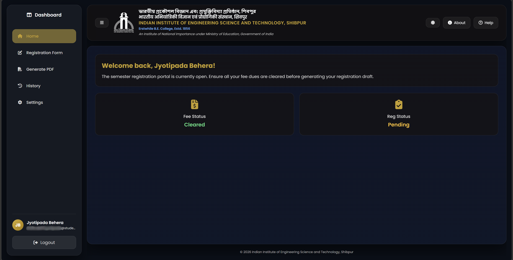
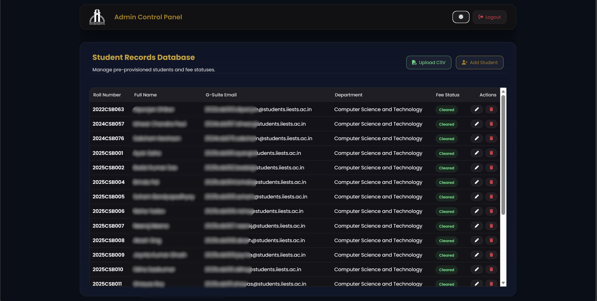
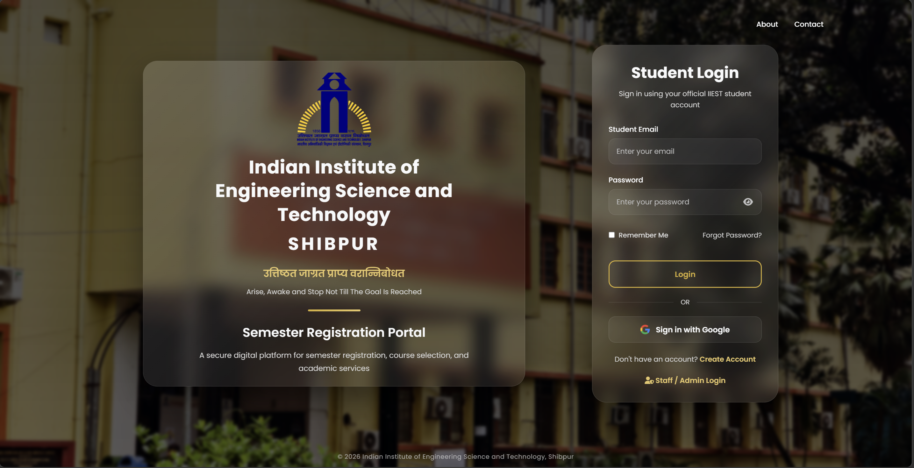
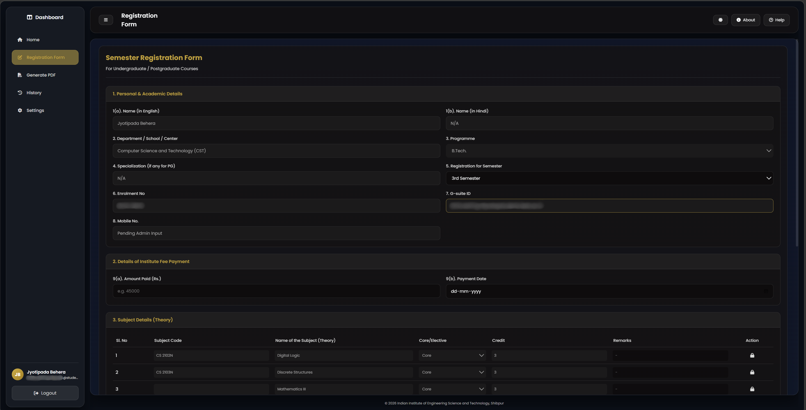

# 🎓 IIEST Shibpur - Digital Semester Registration Portal


A secure, scalable, full-stack web application designed to digitize the semester registration process for the Indian Institute of Engineering Science and Technology (IIEST), Shibpur. 

This portal replaces legacy paper-based workflows with a dual-database architecture, offering a seamless glassmorphism UI for students and a powerful CRUD control panel for administrators.

---

## 📸 Screenshots

| Student Dashboard | Admin Control Panel |
| :---: | :---: |
|  |  |
| **Multi-Step Authentication** | **Dynamic Form & Autofill** |
|  |  |

---

## ✨ Key Features

### 👨‍🎓 Student Portal
* **Advanced Authentication:** Secure login via official G-Suite SSO or Email/OTP password verification.
* **Smart Dashboard:** Modern Glassmorphism UI with Dark/Light mode and dynamic greeting states.
* **Automated Curriculum:** Registration forms dynamically fetch and autofill Theory and Practical core subjects based on the selected semester, preventing data entry errors.
* **Fee Status Guard:** Backend verification blocks registration submissions if institute fee dues are pending.
* **Dynamic PDF Generation:** Converts submitted registration data into an official, downloadable PDF draft.
* **Multi-Language Support:** Integrated Google Translate for English, Hindi, and Bengali localization.

### 🛡️ Admin Control Panel
* **Centralized Database:** View, edit, and manage all pre-provisioned student records in real-time.
* **CSV Bulk Upload:** Provision hundreds of new students instantly via `.csv` file parsing.
* **Live Status Toggles:** Instantly clear or revoke student fee statuses with a single click.
* **Curriculum Management (WIP):** Full CRUD control over departmental courses, credits, and core/elective categorizations.

---

## 🏗️ Technical Architecture

This project utilizes a **Dual-Database Architecture** to separate security concerns from relational data structures.

* **Frontend:** HTML5, CSS3 (Glassmorphism), Vanilla JavaScript (SPA Logic)
* **Backend:** Node.js, Express.js
* **Database 1 (Authentication):** MongoDB (Mongoose) - *Stores hashed passwords, OTPs, and user sessions.*
* **Database 2 (Relational Data):** PostgreSQL (Sequelize ORM) - *Stores structured student records, fee statuses, and the official course curriculum.*
* **Security:** JSON Web Tokens (JWT), Bcrypt.js, Express Rate Limiting.

---

## 🚀 Recent Updates (v2.0.0)
* **August 15, 2026:** Implemented PostgreSQL architecture. Added Admin Dashboard with full CRUD & CSV bulk upload. Built dynamic form logic to autofill Theory/Practical subjects based on the semester.
* **August 14, 2026:** Completed multi-step signup wizard, returning user UI, and fixed authentication bugs.
* **August 13, 2026:** Integrated Google Auth login and squashed UI layout bugs.
* **August 11, 2026:** Compiled initial frontend/backend connections and PDF generation placeholder.

---

## 💻 Local Setup & Installation

### Prerequisites
* Node.js installed
* MongoDB running locally (`mongodb://127.0.0.1:27017`)
* PostgreSQL installed and running with a database named `iiest_portal`

### Installation Steps

1. **Clone the repository:**
   ```bash
   git clone [https://github.com/YourUsername/Mini-Project01.git](https://github.com/YourUsername/Mini-Project01.git)
   cd Mini-Project01

2. **Install Backend Dependencies:**
   ```bash
   cd src/backend
   npm install

3. **Configure Environment Variables:**
   Create a .env file in src/backend and add your database credentials, JWT secrets, and SMTP email settings.

4. **Seed the Databases:**
   Run the following scripts to initialize the Admin account, sample students, and course curriculum:
   ```bash
   node seedAdmin.js
   node seed.js
   node seedCourses.js

5. **Start the Server:**
   ```bash
   node server.js

   The backend will run on http://localhost:5000. Open src/frontend/index.html via Live Server to view the app.

**Maintained by the IIEST Mini-Project Team.**
